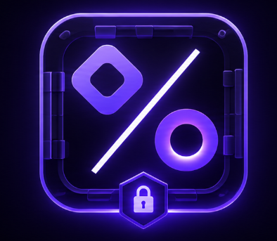

<p align="center">
  
</p>

<h1 align="center">AuditSplit</h1>

<p align="center">
  <strong>Pact before payout.</strong><br />
  Immutable payout agreements for collaborative bug bounty research, built on Monad.
</p>

<p align="center">
  <a href="https://auditsplit.alva-p.xyz/"><strong>Live Demo</strong></a> ·
  <a href="https://github.com/alva-p/spark-buildAnything-hackaton/actions/workflows/ci.yml"></a>
</p>

AuditSplit gives every private collaborative report its own payout vault. Researchers agree on exact shares before submission, every recipient accepts onchain, and each person claims independently when the bounty arrives.

Vulnerability details never go onchain. The browser sends only recipient addresses, shares, and a salted `bytes32` commitment.

## Why it exists

Collaborative bounties are often paid to one personal wallet and split later using messages, spreadsheets, and trust. AuditSplit replaces that manual promise with one immutable vault address accepted by everyone before payout.

## How it works

1. Create a vault with 2–10 recipients and shares totaling exactly 100%.
2. Every recipient accepts the immutable pact.
3. Give the active vault address to the bounty payer.
4. The vault allocates the payment and each recipient claims independently.

The contract uses pull-based claims: one recipient never needs to wait for, or depend on, another.

## Hackathon MVP

- Dedicated non-upgradeable vault for every report.
- Unanimous activation and immutable shares.
- Native MON and ERC-20 accounting, including fee-on-transfer tokens.
- Real Monad transactions with pending, confirmed, and reverted states.
- Browser-only commitment generation; no backend or database.
- Responsive create, accept, payout, and claim flow.
- 25 passing Foundry tests plus frontend lint and production build checks.

## Monad Testnet

| Item | Deployment |
|---|---|
| Network | Monad Testnet · chain ID `10143` |
| Frontend | [auditsplit.alva-p.xyz](https://auditsplit.alva-p.xyz/) |
| Factory | [`0xe3335E3Ea2DbFe0aff7e92331f86AB3C53314536`](https://testnet.monadscan.com/address/0xe3335E3Ea2DbFe0aff7e92331f86AB3C53314536) |
| Factory deployment | [`0x26b26f…5c891be`](https://testnet.monadscan.com/tx/0x26b26f52422aa2328c2a829dde594b6458ae6aedd6d5fa55d8f24cb6e5c891be) |
| Deployer | [`0xB2ca5438D2C30624FC19c9206F41B550d4A502E8`](https://testnet.monadscan.com/address/0xB2ca5438D2C30624FC19c9206F41B550d4A502E8) |
| Verified source | [`exact_match` on Sourcify](https://sourcify-api-monad.blockvision.org/v2/verify/472b0616-7ae6-4eb8-98a6-e111b5a8d014) |

The verified factory runtime bytecode matches the local build exactly.

## Verified end-to-end demo

A live two-recipient payout completed successfully on Monad Testnet with a 75% / 25% split:

| Step | Onchain evidence |
|---|---|
| Demo vault | [`0x6cD726…Fb8907`](https://testnet.monadscan.com/address/0x6cD726b6Ee769fC357a6843016593AEB45Fb8907) |
| Vault creation | [`0x01be25…4cbbc2`](https://testnet.monadscan.com/tx/0x01be2597b268f971ff13bd3a6910f30181d29f583dbaca5f40cc07c4a94cbbc2) |
| 1.4 MON payout | [`0xaaefa4…4b699`](https://testnet.monadscan.com/tx/0xaaefa48949cd5d15551330188c72880fe5a5c0d1c5bad784fc5baf7085f4b699) |
| 25% claim · 0.35 MON | [`0xf91375…7a140`](https://testnet.monadscan.com/tx/0xf91375ccddd92ee328457c5e345868e00c6e0bdb035a61c651ed71876dd7a140) |
| 75% claim · 1.05 MON | [`0xe3d5be…49bb9`](https://testnet.monadscan.com/tx/0xe3d5be23128a60fce02323b277350fee3f78514522984ff38cc5eb87cc449bb9) |

Both recipients finished with zero claimable balance and the vault finished with zero MON held.

## Security choices

- Shares cannot change after creation.
- Every recipient must accept before deposits are enabled.
- Claims follow Checks-Effects-Interactions and use `ReentrancyGuard`.
- ERC-20 transfers use `SafeERC20` and measured balance deltas.
- No administrator can rewrite terms or withdraw user funds.
- No report title, PoC, platform identifier, or vulnerability detail is stored onchain.

This is hackathon software and has not received a production audit. Use it only on Monad Testnet.

## Run locally

Requirements: Node.js 22+, npm, and Foundry.

```bash
git clone https://github.com/alva-p/spark-buildAnything-hackaton.git
cd spark-buildAnything-hackaton/apps/web
npm ci
cp .env.example .env.local
npm run dev
```

The example environment already points to Monad Testnet and the deployed factory. Never add a private key to frontend environment files.

## Verify the repository

```bash
cd contracts
forge install --no-git OpenZeppelin/openzeppelin-contracts foundry-rs/forge-std
cd ..
make verify
npm run check:create --prefix apps/web
```

## Stack

Solidity 0.8.24 · Foundry · OpenZeppelin v5 · Next.js · TypeScript · wagmi · viem · TanStack Query · Vercel Web Analytics
